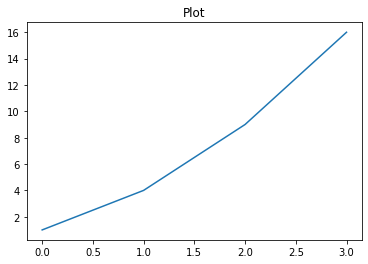

```python
import matplotlib as mpl
import matplotlib.pyplot as plt
%matplotlib inline
```

# 1. Line plot


```python
plt.title("Plot")
plt.plot([1, 4, 9, 16])
plt.show()
```


**markdown:**

    
    /: 절대주소 가능


**markdown:**

    


**markdown:**

    


