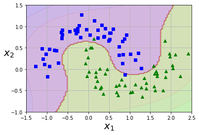
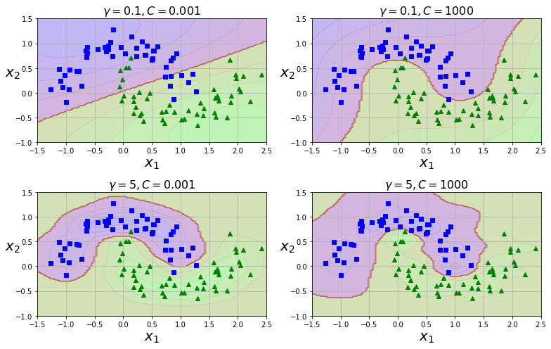

```python
import numpy as np
import matplotlib.pyplot as plt
%matplotlib inline
```


```python
from sklearn import datasets
from sklearn.pipeline import Pipeline
from sklearn.preprocessing import StandardScaler
from sklearn.svm import LinearSVC
from sklearn.linear_model import LogisticRegression
from sklearn.model_selection import train_test_split
from sklearn.metrics import accuracy_score

iris = datasets.load_iris()
X, y = iris['data'][:, (2, 3)], (iris['target'] == 2).astype(np.float64)  # 꽃잎 길이, 너비 / Iris-Virginica
X_train, X_test, y_train, y_test = train_test_split(X, y, test_size=0.2, stratify=y)

svm_clf = Pipeline([
    ('scaler', StandardScaler()),
    ('linear_svc', LinearSVC(C=1, loss='hinge'))
])
svm_clf.fit(X_train, y_train)
svm_pred = svm_clf.predict(X_test)

print(accuracy_score(svm_pred, y_test))
```

    0.9333333333333333


```python
def plot_dataset(X, y, axes):
    plt.plot(X[:, 0][y==0], X[:, 1][y==0], "bs")
    plt.plot(X[:, 0][y==1], X[:, 1][y==1], "g^")
    plt.axis(axes)
    plt.grid(True, which='both')
    plt.xlabel(r"$x_1$", fontsize=20)
    plt.ylabel(r"$x_2$", fontsize=20, rotation=0)
    
def plot_predictions(clf, axes):
    x0s = np.linspace(axes[0], axes[1], 100)
    x1s = np.linspace(axes[2], axes[3], 100)
    x0, x1 = np.meshgrid(x0s, x1s)
    X = np.c_[x0.ravel(), x1.ravel()]
    y_pred = clf.predict(X).reshape(x0.shape)
    y_decision = clf.decision_function(X).reshape(x0.shape)
    plt.contourf(x0, x1, y_pred, cmap=plt.cm.brg, alpha=0.2)
    plt.contourf(x0, x1, y_decision, cmap=plt.cm.brg, alpha=0.1)
```


```python
plot_predictions(svm_clf, [0, 8, -1, 4])
plot_dataset(X, y, [0, 8, -1, 4])
plt.show()
```


```python
from sklearn.datasets import make_moons
from sklearn.pipeline import Pipeline
from sklearn.preprocessing import PolynomialFeatures

X, y = make_moons(n_samples=100, noise=0.15, random_state=42)
polynomial_svm_clf = Pipeline([
    ('poly_features', PolynomialFeatures(degree=3)),
    ('scaler', StandardScaler()),
    ('svm_clf', LinearSVC(C=10, loss='hinge'))
])
polynomial_svm_clf.fit(X, y)
```

    /home/inhaq/anaconda3/lib/python3.6/site-packages/sklearn/svm/base.py:929: ConvergenceWarning: Liblinear failed to converge, increase the number of iterations.
      "the number of iterations.", ConvergenceWarning)


    Pipeline(memory=None,
             steps=[('poly_features',
                     PolynomialFeatures(degree=3, include_bias=True,
                                        interaction_only=False, order='C')),
                    ('scaler',
                     StandardScaler(copy=True, with_mean=True, with_std=True)),
                    ('svm_clf',
                     LinearSVC(C=10, class_weight=None, dual=True,
                               fit_intercept=True, intercept_scaling=1,
                               loss='hinge', max_iter=1000, multi_class='ovr',
                               penalty='l2', random_state=None, tol=0.0001,
                               verbose=0))],
             verbose=False)


```python
plot_predictions(polynomial_svm_clf, [-1.5, 2.5, -1, 1.5])
plot_dataset(X, y, [-1.5, 2.5, -1, 1.5])
plt.show()
```





```python
from sklearn.svm import SVC
poly_kernel_svm_clf = Pipeline([
    ('scaler', StandardScaler()),
    ('svm_clf', SVC(kernel='poly', degree=10, coef0=100, C=5))  # default: coef0=0
])
poly_kernel_svm_clf.fit(X, y)

plot_predictions(poly_kernel_svm_clf, [-1.5, 2.5, -1, 1.5])
plot_dataset(X, y, [-1.5, 2.5, -1, 1.5])
plt.show()
```


```python
gamma1, gamma2 = 0.1, 5
C1, C2 = 0.001, 1000
hyperparams = (gamma1, C1), (gamma1, C2), (gamma2, C1), (gamma2, C2)

svm_clfs = []
for gamma, C in hyperparams:
    rbf_kernel_svm_clf = Pipeline([
            ("scaler", StandardScaler()),
            ("svm_clf", SVC(kernel="rbf", gamma=gamma, C=C))
        ])
    rbf_kernel_svm_clf.fit(X, y)
    svm_clfs.append(rbf_kernel_svm_clf)

plt.figure(figsize=(11, 7))

for i, svm_clf in enumerate(svm_clfs):
    plt.subplot(221 + i)
    plot_predictions(svm_clf, [-1.5, 2.5, -1, 1.5])
    plot_dataset(X, y, [-1.5, 2.5, -1, 1.5])
    gamma, C = hyperparams[i]
    plt.title(r"$\gamma = {}, C = {}$".format(gamma, C), fontsize=16)

plt.tight_layout()
plt.show()
```





```python
from sklearn.svm import LinearSVR

svm_reg = LinearSVR(epsilon=1.5)
svm_reg.fit(X, y)
```


    LinearSVR(C=1.0, dual=True, epsilon=1.5, fit_intercept=True,
              intercept_scaling=1.0, loss='epsilon_insensitive', max_iter=1000,
              random_state=None, tol=0.0001, verbose=0)


```python
from sklearn.svm import SVR

svm_poly_reg = SVR(kernel='poly', degree=2, C=100, epsilon=0.1)
svm_poly_reg.fit(X, y)
```

    /home/inhaq/anaconda3/lib/python3.6/site-packages/sklearn/svm/base.py:193: FutureWarning: The default value of gamma will change from 'auto' to 'scale' in version 0.22 to account better for unscaled features. Set gamma explicitly to 'auto' or 'scale' to avoid this warning.
      "avoid this warning.", FutureWarning)


    SVR(C=100, cache_size=200, coef0=0.0, degree=2, epsilon=0.1,
        gamma='auto_deprecated', kernel='poly', max_iter=-1, shrinking=True,
        tol=0.001, verbose=False)


